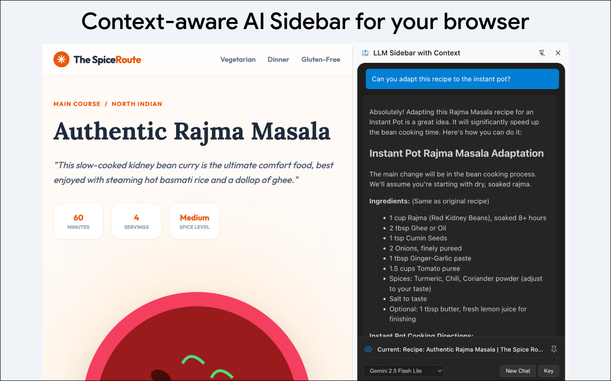

# LLM Sidebar with Context

<div align="center">
  
</div>

This Chrome Extension allows you to interact with Gemini models in a sidebar, using multiple browser tabs as context for your conversations.

**Disclaimer:** This project is not an official Google project. It is not supported by Google and Google specifically disclaims all warranties as to its quality, merchantability, or fitness for a particular purpose.

## 🚀 Features

- **Frontend Only:** This extension runs entirely in your browser. There is no middle-man server; your prompts are sent directly from your browser to the Google Gemini API.
- **Context-Aware Chat:** Pin up to 6 tabs to use their content as context for your prompts.
- **Multimodal Support:**
  - **YouTube:** Summarize or answer questions about YouTube videos.
  - **Google Docs:** Extracts content directly from open Google Docs.
  - **Web Pages:** Extracts text content from standard web pages.
- **Current Tab Sharing:** Toggle "Share Current Tab" (Eye icon) to dynamically include the active tab's content in your context as you browse.
- **Model Selection:** Choose between various Gemini models:
  - Gemini 2.5 Flash Lite (Default)
  - Gemini 2.5 Flash
  - Gemini 2.5 Pro
  - Gemini 3 Flash (Preview)
- **Privacy Focused:**
  - Your API Key is stored locally in your browser (`chrome.storage.sync`).
  - Chat history is stored locally (`chrome.storage.local`).
- **Markdown Support:** Responses are rendered with full Markdown support.

## 📦 Installation

This extension is currently available for manual installation.

1.  **Clone the repository:**

    ```bash
    git clone https://github.com/google/llm-sidebar-with-context.git
    cd llm-sidebar-with-context
    ```

2.  **Install dependencies:**

    ```bash
    npm install
    ```

3.  **Build the extension:**

    ```bash
    npm run build
    ```

    _Note: This generates a `dist/` directory._

4.  **Load into Chrome:**
    1.  Open Chrome and navigate to `chrome://extensions`.
    2.  Enable **Developer mode** (toggle in the top right).
    3.  Click **Load unpacked**.
    4.  Select the `dist` folder created in step 3.

## ⚙️ Configuration

1.  **Get a Gemini API Key:**
    - Visit [Google AI Studio](https://aistudio.google.com/).
    - Create a new API key.

2.  **Setup the Extension:**
    - Click the extension icon  in your browser toolbar to open the sidebar.
    - Click the **Settings** button in the bottom panel.
    - Enter your API Key.
    - (Optional) Select your preferred Model.

## 🛠️ Usage

1.  **Open Sidebar:** Click the extension icon  in your browser toolbar.
2.  **Pin Context:**
    - Navigate to a page you want to discuss.
    - Click the **Pin** icon next to the "Current Tab" to add it to your pinned context.
    - You can pin up to 6 tabs.
3.  **Chat:** Type your prompt. The extension will send your message along with the content of all pinned tabs to Gemini.
4.  **Manage Context:**
    - Toggle the **Eye** icon on the "Current Tab" to automatically include whichever tab you are looking at.
    - Click the **Trash** icon to clear a pinned tab.

## 💻 Development

### Prerequisites

- Node.js (v20+)
- npm

### Commands

| Command              | Description                     |
| :------------------- | :------------------------------ |
| `npm run build`      | Builds the extension to `dist/` |
| `npm test`           | Runs unit tests with Vitest     |
| `npm run lint`       | Runs ESLint                     |
| `npm run format`     | Formats code with Prettier      |
| `npm run type-check` | Runs TypeScript type checking   |

### Environment Variables

To populate legal links in the Settings panel, create a `.env` file in the root:

```env
LEGAL_NOTICE_URL="https://example.com/legal"
PRIVACY_POLICY_URL="https://example.com/privacy"
LICENSE_URL="https://example.com/license"
```

## 🤝 Contributing

See [`CONTRIBUTING.md`](CONTRIBUTING.md) for details.

## 📄 License

Apache 2.0; see [`LICENSE`](LICENSE) for details.
