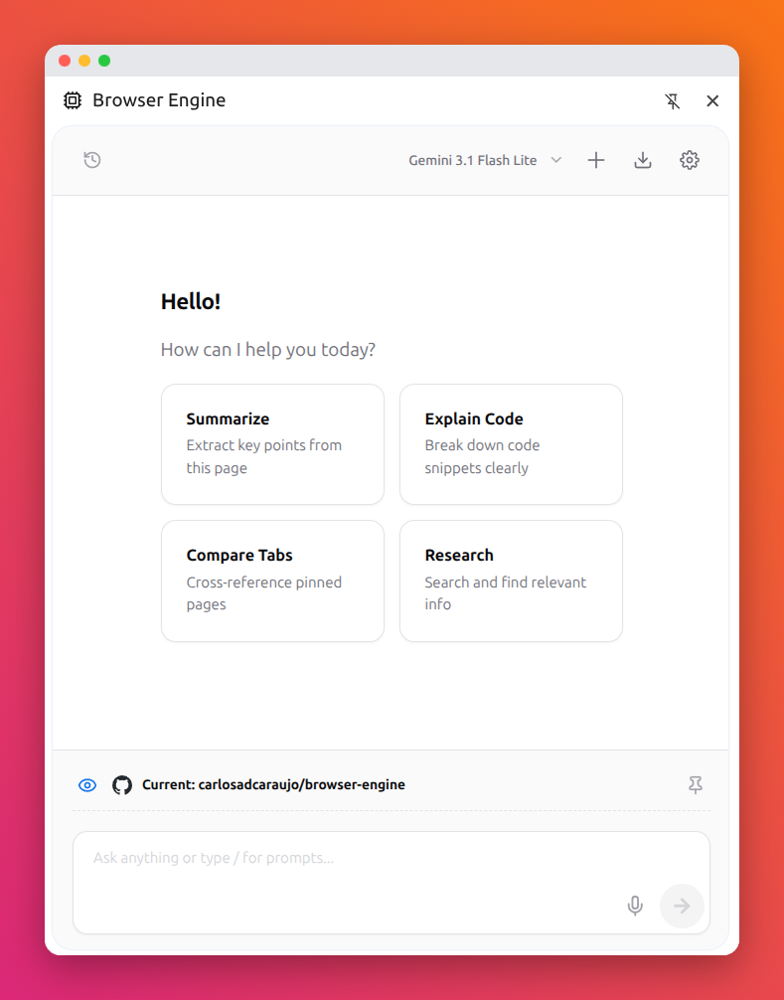
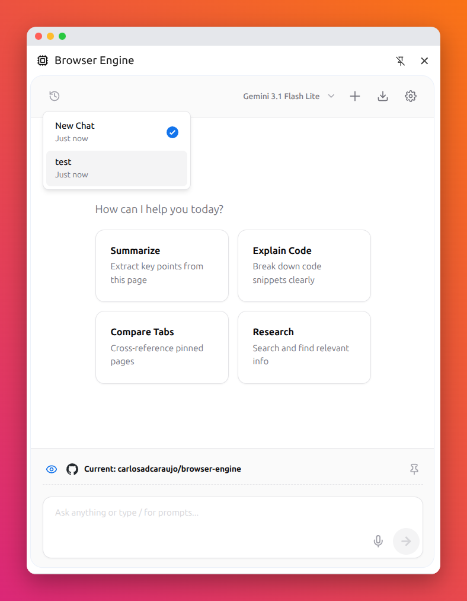
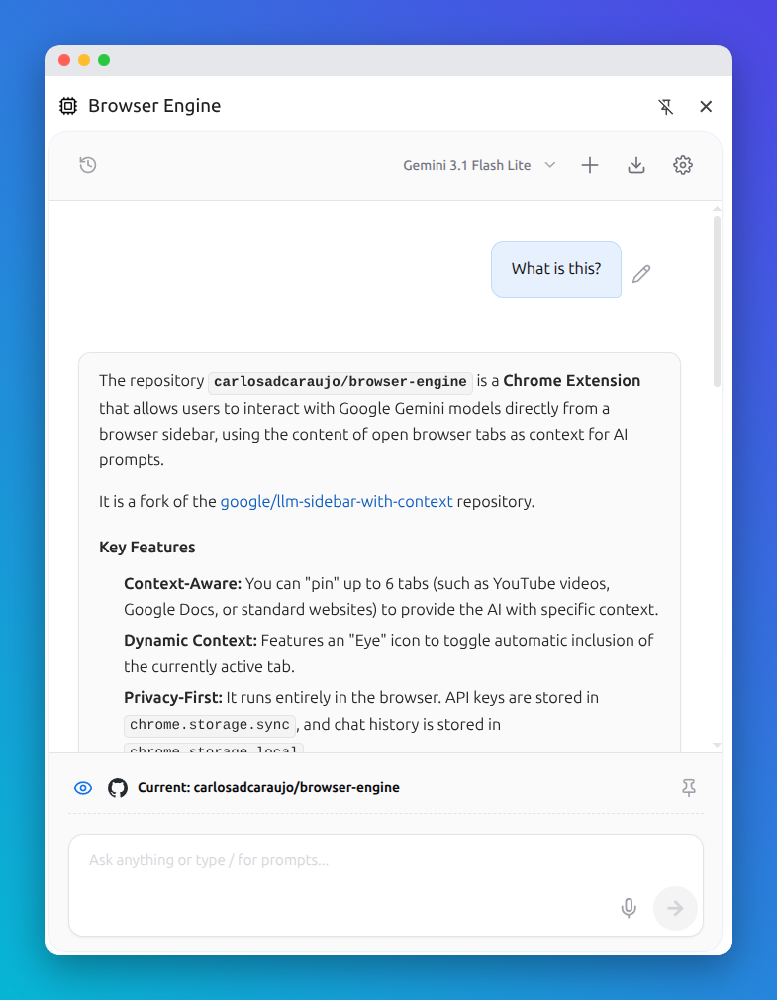
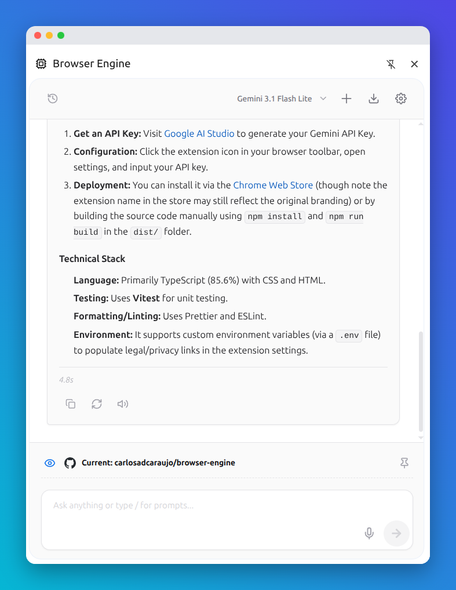

# Browser Engine

**Browser engine** is a context-aware AI sidebar for Chrome. Pin up to 6 tabs and get answers without leaving your workflow. Free, open source, and runs entirely in your browser.

<div align="center">
  
  <br><br>
  
    <br><br>
  
  <br><br>
  
  <br><br>
</div>

## 🚀 Features

### Core

- **Frontend Only** — No middleman server. Your prompts go directly from your browser to the AI API.
- **Multi-Tab Context** — Pin up to 6 tabs and feed their content as context for your prompts.
- **Current Tab Sharing** — Toggle the eye icon to dynamically include whichever tab is active.
- **Multi-Source Support** — Extracts content from YouTube, Google Docs, and standard web pages with noise removal.
- **Sandwich Truncation** — Smart context-window management so long pages don't break your flow.
- **Stop Generation** — Hit stop mid-response when you've seen enough.

### Chat & History

- **Local Chat History** — Every conversation is saved automatically with timestamps and a title generated from your first message.
- **Chat Sessions** — Create, switch between, rename, and delete multiple conversations via the dropdown in the header bar.
- **Edit Messages** — Click the edit icon on any user message, rewrite it, and resubmit — the conversation re-runs from that point. (Branching coming soon.)
- **Regenerate Responses** — Hit the redo icon on any model reply to re-roll it.
- **Export Chat** — One-click export of the active conversation as a Markdown file.
- **Welcome Suggestions** — Smart prompt cards on first open: Summarize, Explain Code, Compare Tabs, Research.

### Actions & Accessibility

- **Copy to Clipboard** — Copy any model response with one click (with visual feedback).
- **Read Aloud** — Hear responses spoken via the Web Speech API (browser-native TTS, no cloud dependency).
- **Keyboard Friendly** — Enter to send, Shift+Enter for newline, Escape to cancel edits.

### UI & Theming

- **Shadcn-Style Design System** — Clean, semantic HTML with CSS layers, custom properties, cards, and consistent spacing. No framework, no div soup.
- **Light / Dark / System Theme** — Persisted to storage, with live toggle in Settings.
- **Model Selector** — Dropdown in the header to switch between available Gemini models.
- **Favicon Support** — Tab favicons shown in the pinned-tabs bar and current-tab display.
- **Response Timer** — Each model reply shows how long it took (e.g. `2.3s`).
- **Responsive Composer** — Pill-shaped input bar that auto-resizes; Send button activates only when there's content.
- **Semantic HTML & ARIA** — Built with `role="log"`, `aria-live="polite"`, landmark elements, and accessible buttons throughout.

### Privacy & Storage

- **API Key** — Stored in `chrome.storage.sync` (encrypted-at-rest by Chrome).
- **Chat History** — Stored in `chrome.storage.local` (never leaves your machine).
- **No Telemetry** — Zero analytics, zero tracking, zero network calls except to the AI API you configure.

## ⚙️ Quick Start

1. **Get an API key** from your preferred AI provider (e.g. Google AI Studio, OpenAI, etc.).
2. **Install the extension** build it yourself. Chrome store coming soon.
3. **Click the extension icon**  in your toolbar.
4. **Open Settings** (bottom panel), enter your API key, pick a model.
5. **Pin tabs** you want to talk about, type your prompt, and go.

## 🛠️ Build Manually (Development)

```bash
git clone <your-repo-url>
cd browser-engine
pnpm install
pnpm run build
```

This generates a `dist/` directory.

### Load into Chrome

1. Open Chrome → `chrome://extensions`
2. Enable **Developer mode** (top right toggle)
3. Click **Load unpacked**
4. Select the `dist` folder

## 💻 Development

### Prerequisites

- Node.js v20+
- npm

### Commands

| Command              | Description                     |
| :------------------- | :------------------------------ |
| `npm run build`      | Builds the extension to `dist/` |
| `npm test`           | Runs unit tests with Vitest     |
| `npm run lint`       | Runs ESLint                     |
| `npm run format`     | Formats code with Prettier      |
| `npm run type-check` | Runs TypeScript type checking   |

### Environment Variables

To populate legal links in the Settings panel, create a `.env` file:

```env
LEGAL_NOTICE_URL="https://example.com/legal"
PRIVACY_POLICY_URL="https://example.com/privacy"
LICENSE_URL="https://example.com/license"
```

## 🤝 Contributing

See [`CONTRIBUTING.md`](CONTRIBUTING.md).

## 📄 License

Apache 2.0 — see [`LICENSE`](LICENSE).

---

> This is a **fork** of the original [llm-sidebar-with-context](https://github.com/google/llm-sidebar-with-context). Thank you to the original authors.

> [!IMPORTANT]
> Currently supports **Gemini** only. More providers (OpenAI, Claude, Groq, etc.) are on the roadmap.
>
> This project is **not** an official Google product. It is not supported by Google and Google specifically disclaims all warranties as to its quality, merchantability, or fitness for a particular purpose.

---

## Sponsorship

Being based in Africa makes it particularly difficult to receive financial support for open source projects. That shouldn't stop me from asking and that shouldn't stop you from supporting. Contact me directly and we will find a way carlos@caraujo.com (spammers please spare me).

## Hire me

- Linkedin https://www.linkedin.com/in/carlos-alberto-da-conceicao-araujo/
- X account https://x.com/carlosadcaraujo
- Personal website https://caraujo.com

"Here's the deal Dick, i'm the best there is plain and simple. If you ain't first, you're last." - Ricky Bobby
